# RestoreClick Data Flow Diagrams

## System Architecture Overview

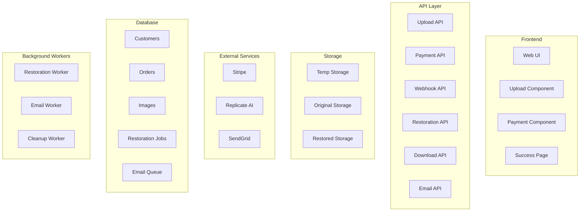

## Detailed Flow Diagrams

### 1. Complete User Journey

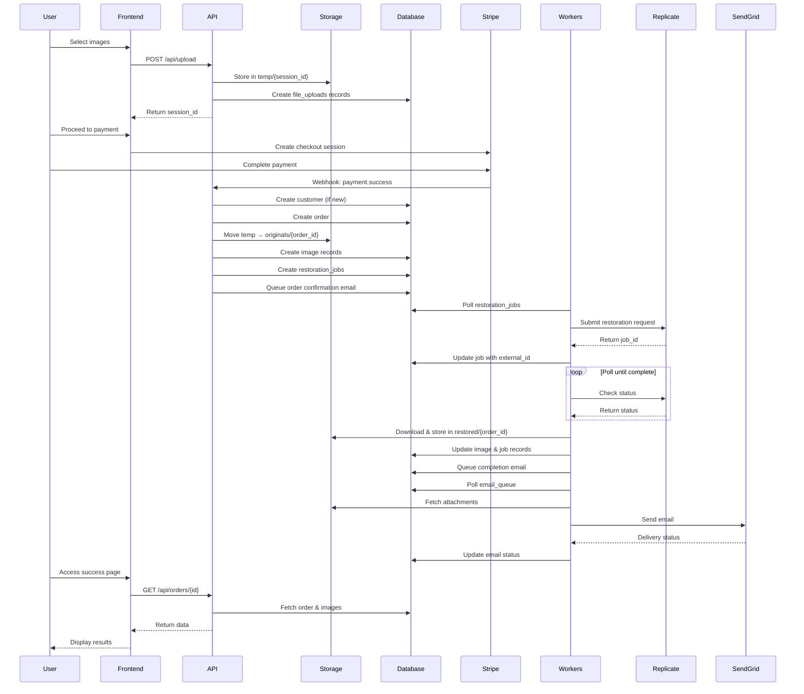

### 2. Image Upload Flow

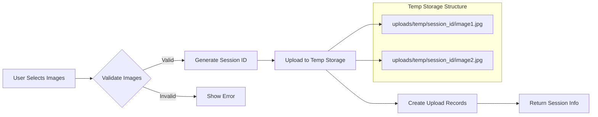

### 3. Payment Processing Flow

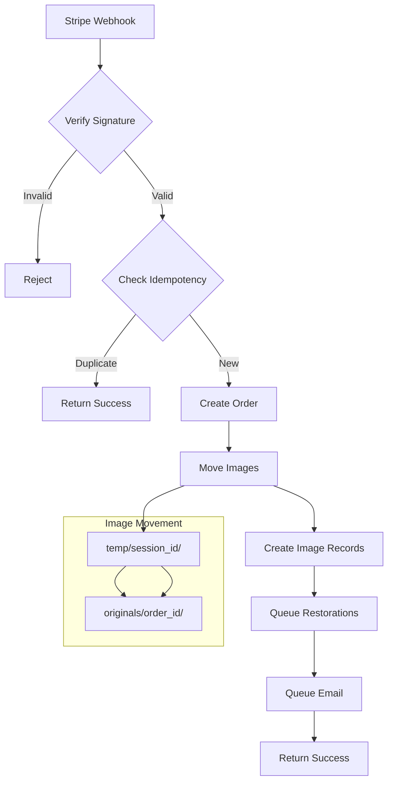

### 4. Restoration Processing Flow

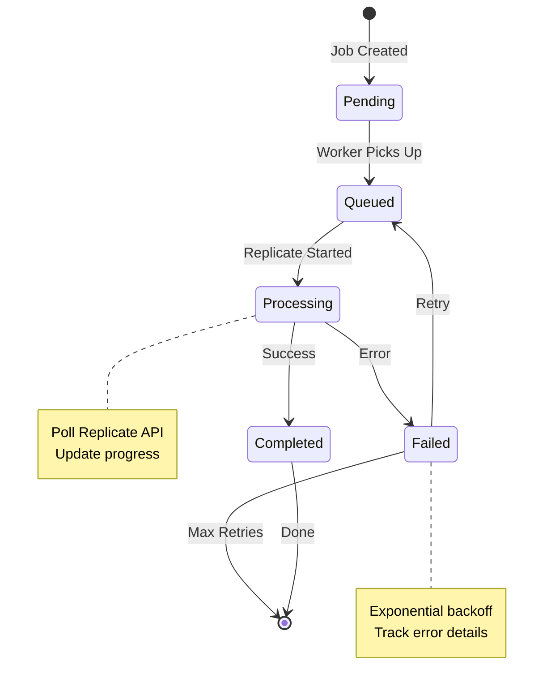

### 5. Email Queue Processing

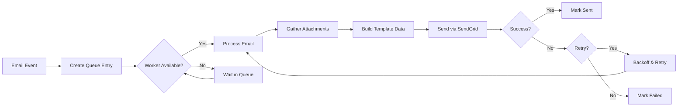

### 6. Storage Structure

```
photos/
├── uploads/
│   ├── temp/
│   │   └── {session_id}/
│   │       ├── image1.jpg
│   │       └── image2.jpg
│   ├── originals/
│   │   └── {order_id}/
│   │       ├── IMG_001_original.jpg
│   │       └── IMG_002_original.jpg
│   └── restored/
│       └── {order_id}/
│           ├── IMG_001_restored.jpg
│           └── IMG_002_restored.jpg
└── downloads/
    └── {order_id}/
        └── {timestamp}_all_photos.zip
```

### 7. Database State Transitions

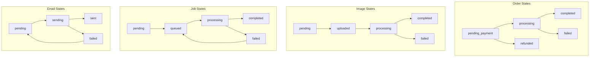

## Error Handling Flows

### Restoration Failure Recovery

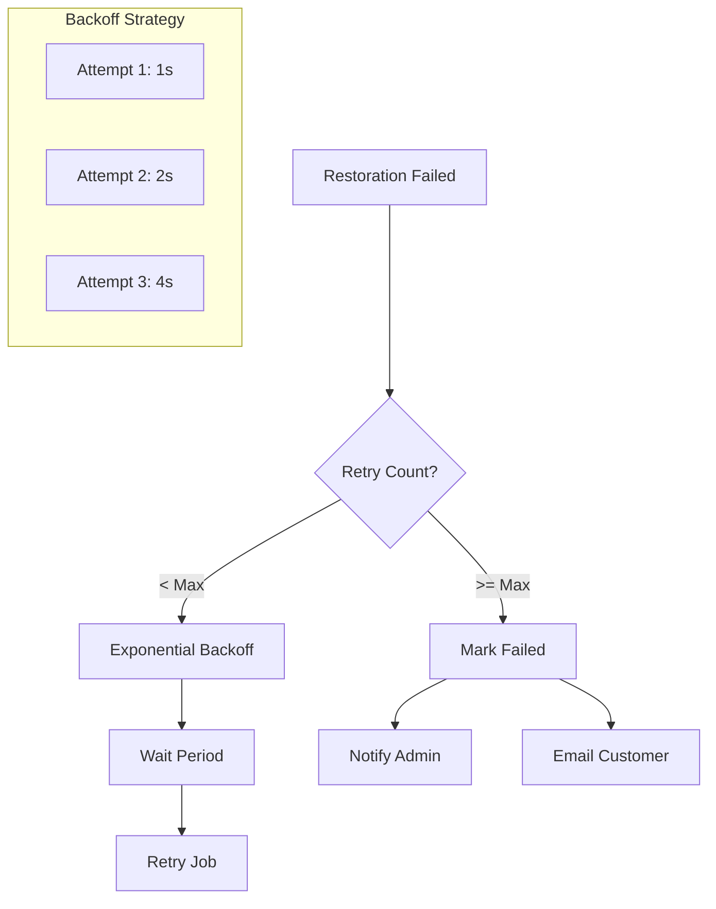

### Payment Failure Handling

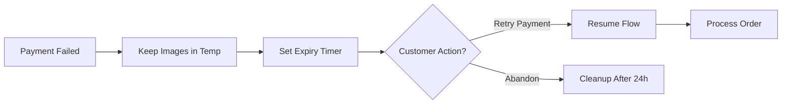

## Security Considerations

### Download Token Flow

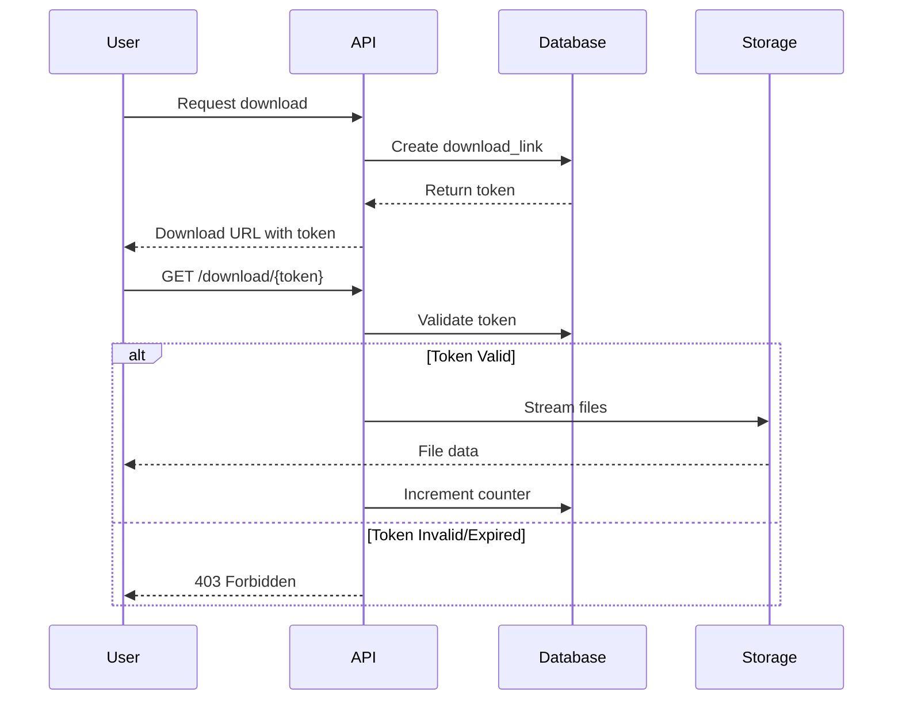

## Monitoring & Alerts

### System Health Checks

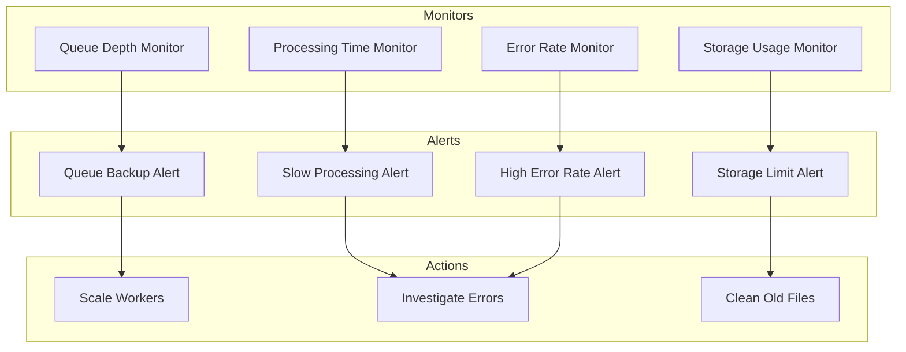

## Implementation Notes

1. **Idempotency**: All operations must be idempotent using unique keys
2. **Transactions**: Use database transactions for multi-step operations
3. **Timeouts**: Set appropriate timeouts for external API calls
4. **Logging**: Comprehensive logging at each step for debugging
5. **Metrics**: Track key metrics for performance monitoring
6. **Cleanup**: Automated cleanup of temporary files and expired data
